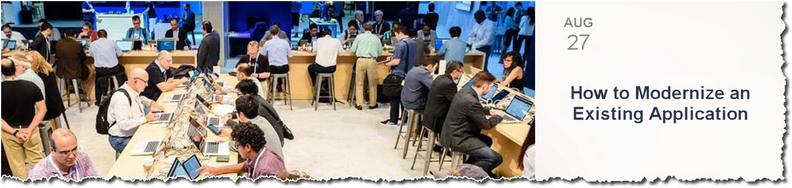

**Session Objective:**  How to "modernize" and existing application (Application Modernization). Overview of the "what" and "why" of Docker containers and an overview of container orchestration with Kubernetes. In addition to lecture and discussion will be some hands on labs to demonstrate how to install the required tools, create a "Docker Container image" (docker build) and deploy it using Kubernetes on the IBM Cloud Private (ICP) platform. Attending this session will give you the basic skills to explore and experiment with containers to determine how they best fit your use cases, or just to have fun with them!

---

### Agenda Overview

**Presentation and Discussion**

In this segment we'll talk through the basics:
- What are "containers" and where did they come from?
- What is the difference between containers and Virtual Machines (VM's)?
- What is "container orchestration" and what's [Kubernetes](https://kubernetes.io/) all about?
- How does this change things for applications today?
- Introduction to IBM Cloud Private (ICP).

**Exercises**

- [lab 00](lab00/README.md): Creating a working environment
- [lab 01](lab01/README.md): Example ---> How to *run* an existing Docker container (a Ubuntu 16.04 container)
- [lab 02](lab02/README.md): Taking an existing web app: --> *build* a "Docker container image" of it and *run* the "Docker container" on your "local machine", then *stop* it.

**Getting Started with Kubernetes (k8s)**

- [lab 03](lab03/README.md): Running Kubernetes with ICP
- [lab 04](lab04/README.md): Example ---> How to deploy a container to Kubernetes

**Deploying the existing web app on Kubernetes**

- [lab 05](lab05/README.md): Upload the web app image to [Dockerhub](https://hub.docker.com/) and deploy/*run* the "Docker container" on our ICP cluster using Kubernetes

**Questions?**

---
