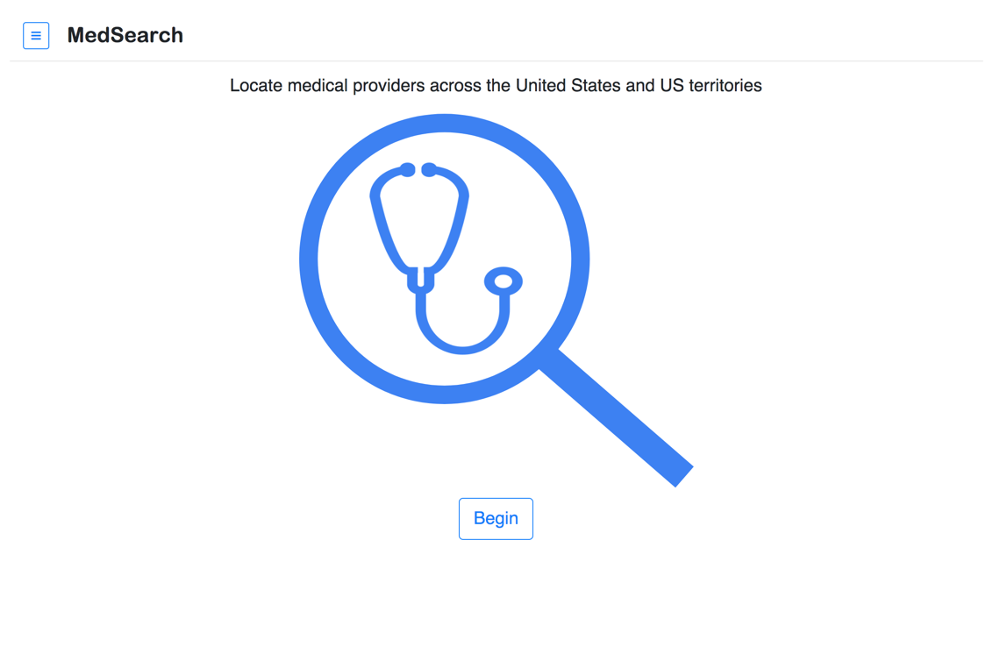
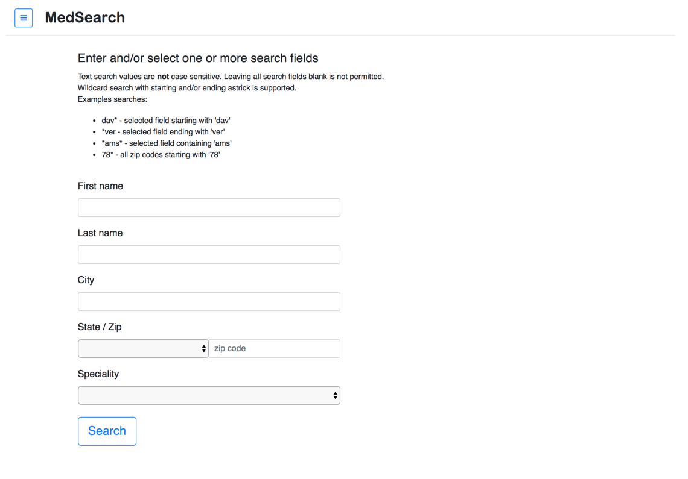
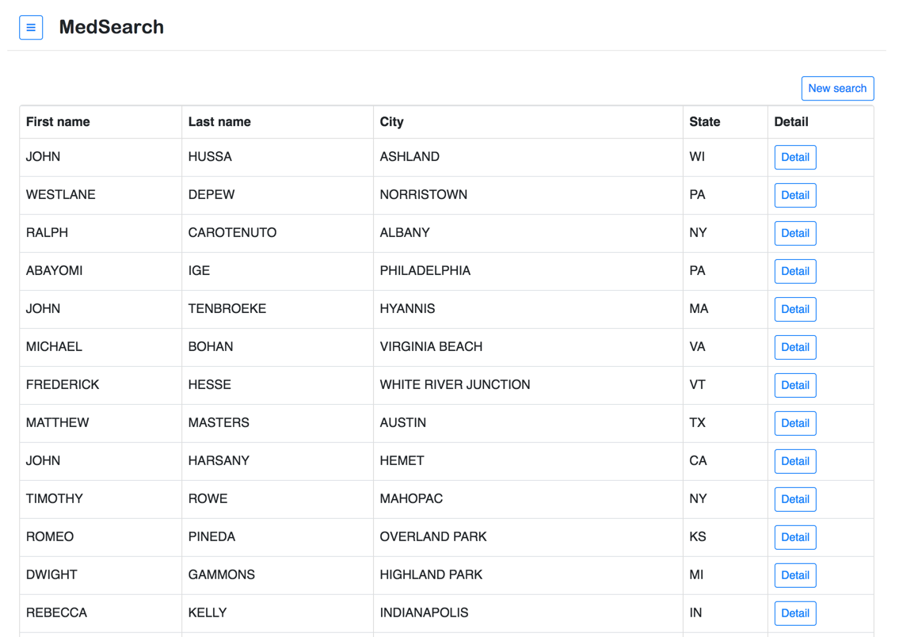
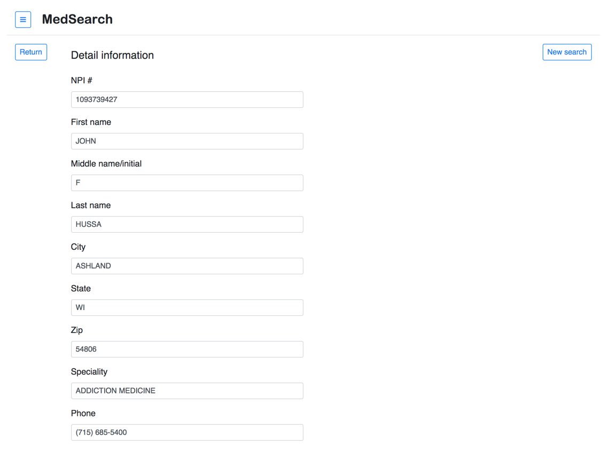
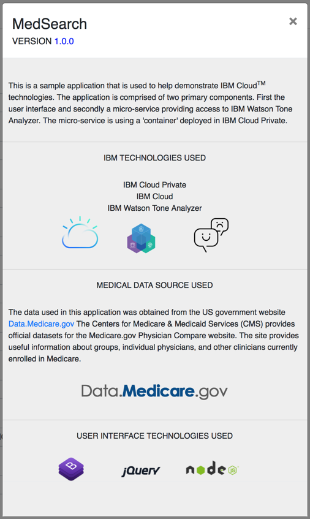

## Review legacy applicaiton

In this section, we'll review the existing source legacy applicaiton.

Open browser to instructor provided url.

MedSearch enables users to search for medical providers across the nation. Searching by name, location, or specialty is provided.  Review the applicaiton capabilities to help understand what will be used in following labs.

### MedSearch - Home page

Press the 'Begin' button to start searching for medical providers.

### MedSearch - Search parameters

Provide one or more search parameters and press the 'Search' button to search the data repository.

### MedSearch - Search reults

Results matching the search criteria are provided. Press the 'Detail' button at the right hand side of the results to view detail information.

### MedSearch - Detail provider information

Detail information for the selected provider.  Press the 'Return' button to return to the previous search results.  Press the 'New search' button to provide new search parameters.

### MedSearch - About

Information about the technology and data used to create MedSearch. 

Congratulations! - you've completed lab01

### Source code

Application source code is located at the following location:

[https://github.com/IBM-ICP-CoC/MedSearch]()

---
