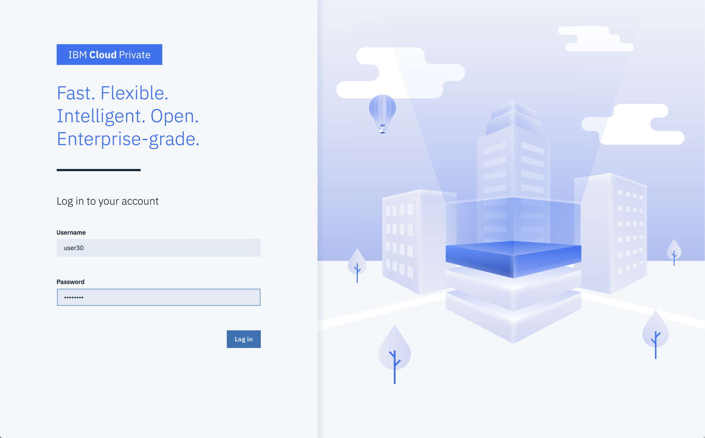

## Re-Host ("lift and shift") 

### Containerize the MedSearch application to be moved to the cloud

The presenter will demonstrate detail steps to accomplish the re-hosting of the MedSearch application.  The following steps were performed to accomplish the containerization of the existing application. 

  

### Instructor performed tasks:
---
 

- Obtain the application source code

- Build the 'Dockerfile' to be used to create the container

- Build a Docker container that will contain the MedSearch application

- Tag the Docker container

- Push the Docker container into a public repository (Docker Hub).  

- Discuss private repositories

- Create a Helm chart to ease the deployment of the container

- Add helm chart to helm repository

  

### Attendee tasks:

---
##### Task 1

Open a browser to the provided URL.  You will be prompted with messages regarding the site security.  This site uses self-signed certificates and you must allow the browser to access the site to continue.  Once at the Login screen for IBM Cloud Private provide the user id and password.  This information will be provided by the presenter.  

---

  

---
##### Task 2

After successfully logging in the Welcome screen is presented.  From this screen select the 'Catalog' menu option.  The menu option is located in the upper right portion of the screen.

---

  

---
##### Task 3

The Catalog screen shows an array of icons and brief descriptions for the authorized helm charts the user may access.  Select the MedSearch helm chart icon.

MedSearch Helm chart (enlarged view)

---

  

---
##### Task 4

Review the helm chart description and then press the 'Configure' button located in the lower right portion of the screen.

---

  

---
##### Task 5

The helm chart must be provided multiple parameters before it can be successfully deployed.  

- Enter a name for the chart to be deployed as indicated by arrow one.  
- Select the target namespace that matches your user id from the drop down, arrow two. 
- Press the 'Install' button, arrow three.

---

  

---
##### Task 6
 
If all parameters are properly provided / selected a modal screen is shown with the options to 'Return to Catalog' or 'View Helm Release'.  Select 'View Helm Release'.

---

  

---
##### Task 7

This screen provides information regarding all of the Kubernetes resource types deployed by the helm chart.  Notice there are two resource types shown in the screen.  The first is a Kubernetes Pod with a workload resource type of Deployment.  This Pod is how the docker container is initiated and running within Kubernetes.  The second Kubernetes resource type shown a 'Service'.  A Kubernetes Service is an abstraction which defines a logical set of Pods and a policy by which to access them.  Note the network related information shown, e.g. Cluster IP, External IP, Ports, etc.  

Select the link under the 'Name' column in the Service section.

---

  

---
##### Task 8
Detail information regarding the service is shown.  Select the link to the right of the field labelled 'Node Port'.  This will provide access to the running application in the docker container. 

---

  

---
#### Task 9

The home screen for MedSearch is launched.  The application enables users to search for medical providers across the nation. Searching by name, location, or specialty is provided.  Review the application capabilities to help understand what will be used in following labs.

---

### Re-Hosting ("lift and shift") completed
---
