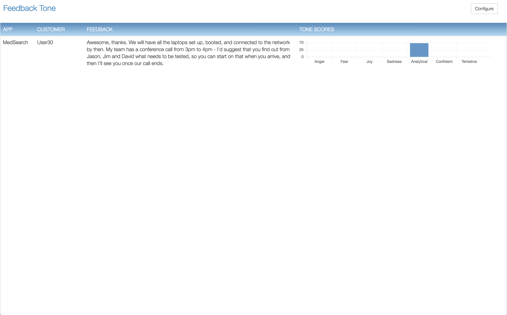

## Re-Factor  

### Add containerized microservice to extend the MedSearch application to provide the feedback service.

The presenter will demonstrate detail steps to accomplish the re-hosting of the MedSearch application.  The following steps were performed to accomplish the containerization of the existing application. 

  

### Instructor performed tasks:
---
 

- Obtain the application source code

- Build the 'Dockerfile' to be used to create the container

- Build a Docker container that will contain the MedSearch application

- Tag the Docker container

- Push the Docker container into a public repository (Docker Hub).  

- Discuss private repositories

- Create a Helm chart to ease the deployment of the container

- Add helm chart to helm repository

  

### Attendee tasks:

---
##### Task 1

Open a browser to the provided URL.  You will be prompted with messages regarding the site security.  This site uses self-signed certificates and you must allow the browser to access the site to continue.  Once at the Login screen for IBM Cloud Private provide the user id and password.  This information will be provided by the presenter.  

---

  

---
##### Task 2

After successfully logging in the Welcome screen is presented.  From this screen select the 'Catalog' menu option.  The menu option is located in the upper right portion of the screen.

---

  

---
##### Task 3

The Catalog screen shows an array of icons and brief descriptions for the authorized helm charts the user may access.  Select the MedSearch helm chart icon.

MedSearch Helm chart (enlarged view)

---

  

---
##### Task 4

Review the helm chart description and then press the 'Configure' button located in the lower right portion of the screen.

---

  

---
##### Task 5

The helm chart must be provided multiple parameters before it can be successfully deployed.  

- Enter a name for the chart to be deployed as indicated by arrow one.  
- Select the target namespace that matches your user id from the drop down, arrow two. 
- Press the 'Install' button, arrow three.

---

  

---
##### Task 6
 
If all parameters are properly provided / selected a modal screen is shown with the options to 'Return to Catalog' or 'View Helm Release'.  Select 'View Helm Release'.

---

  

---
##### Task 7

This screen provides information regarding all of the Kubernetes resource types deployed by the helm chart.  Notice there are two resource types shown in the screen.  The first is a Kubernetes Pod with a workload resource type of Deployment.  This Pod is how the docker container is initiated and running within Kubernetes.  The second Kubernetes resource type shown a 'Service'.  A Kubernetes Service is an abstraction which defines a logical set of Pods and a policy by which to access them.  Note the network related information shown, e.g. Cluster IP, External IP, Ports, etc.  

Select the link under the 'Name' column in the Service section.

---

  

---
##### Task 8
Detail information regarding the service is shown.  Select the link to the right of the field labelled 'Node Port'.  This will provide access to the running application in the docker container. 

---

  

---
#### Task 9

The home screen for Feedback is launched.  The application displays the user submitted feedback and the scoring of the Tone Analyzer categories.

---

  

---
#### Task 10

The home screen for Feedback is launched.  The application displays the user submitted feedback and the scoring of the Tone Analyzer categories.

---

  

---
#### Task 11

Configure the required authorization for the Feedback application to access the Tone Analyzer service.  Select the 'Configure' button in the upper right portion of the screen.  The configuration screen is shown.  Provide or edit the information to access the Tone Analyzer service. 

Press the 'Configure / Validate' button to continue.  If the data is incorrect a red 'X' with an error message will be displayed in the bottom portion of the screen.

---

  

---
#### Task 12

Select the browser window for the MedSearch application.  Select the navigation option in the upper left corner and select the 'Enable feedback' option.  Selecting this option enables the ability to submit feedback to the new microservice.  The design and work to add this to an actual application was not accomplished in the task.  This approach enables the user to add this feature without having to modify the MedSearch application. 

---

  

---
#### Task 13

The 'Feedback' icon is now present in the upper right portion of the MedSearch screen.  When this icon is pressed the new screen dialog to submit feedback is shown.

---

  

---
#### Task 14

The 'Feedback' dialog modal is opened when the feedback icon is pressed.  Provide the user 'Name' and 'Feedback'.  The value to enter in the API Url field is obtained from the Feedback microservice.

---

  

---
#### Task 15

The 'Feedback' dialog modal is opened when the feedback icon is pressed.  Provide the user 'Name' and 'Feedback'.  

The value for the API Url is obtained from the actual feedback application.  The url for the Feedback application as shown in the url field is the value to enter in the field labeled.  Once the API Url is provided press the 'Submit Feedback' button.

---

  

---
#### Task 16

Switch to the 'Feedback' application and view the results.  The user name, feedback and the scoring of the feedback is provided.

---

### Re-Factor completed
---
